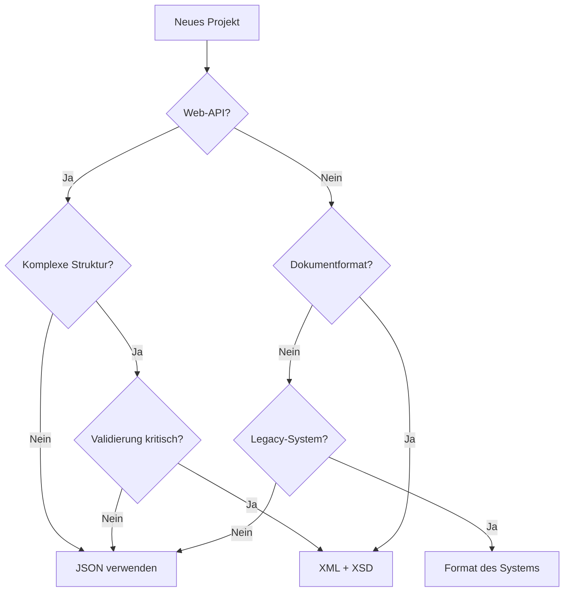

# Arbeitsblatt: JSON und XML - Wiederholung für Anwendungsentwickler
**Zielgruppe:** Auszubildende Fachinformatiker für Anwendungsentwicklung, 3. Ausbildungsjahr  
**Thema:** Datenformate JSON und XML im Vergleich  
**Art:** Wiederholung und Vertiefung  

---

## 1. Grundlegender Aufbau

### JSON (JavaScript Object Notation)

**Syntax-Grundelemente:**
```json
{
  "schlüssel": "wert",
  "zahl": 42,
  "boolean": true,
  "null": null,
  "array": [1, 2, 3],
  "objekt": {
    "unterelement": "verschachtelt"
  }
}
```

**Datentypen in JSON:**
- String (in Anführungszeichen)
- Number (Ganzzahl oder Gleitkomma)
- Boolean (true/false)
- Null
- Object (geschweiften Klammern {})
- Array (eckige Klammern [])

### XML (eXtensible Markup Language)

**Syntax-Grundelemente:**
```xml
<?xml version="1.0" encoding="UTF-8"?>
<wurzelelement>
  <person id="1">
    <name>Max Mustermann</name>
    <alter>42</alter>
    <aktiv>true</aktiv>
    <hobbies>
      <hobby>Programmieren</hobby>
      <hobby>Lesen</hobby>
    </hobbies>
  </person>
</wurzelelement>
```

**XML-Komponenten:**
- XML-Deklaration (optional)
- Elemente (Tags)
- Attribute
- Text-Inhalt
- Namespaces
- CDATA-Bereiche
- Kommentare

---

## 2. Vergleichstabelle JSON vs. XML

| Kriterium | JSON | XML |
|-----------|------|-----|
| **Lesbarkeit** | Sehr gut für Menschen und Maschinen | Gut strukturiert, aber verbose |
| **Dateigröße** | Kompakt, weniger Overhead | Größer durch Tags und Attribute |
| **Datentypen** | Native Unterstützung (String, Number, Boolean, etc.) | Alles ist Text, Typen über Schema |
| **Validierung** | JSON Schema | XSD, DTD |
| **Namespaces** | Nicht unterstützt | Voll unterstützt |
| **Kommentare** | Nicht standardmäßig | Unterstützt `<!-- -->` |
| **Attribute** | Nicht vorhanden | Unterstützt |
| **Arrays** | Native Unterstützung | Durch wiederholte Elemente |

---

## 3. Verwendungsweisen in der Praxis

### JSON - Typische Einsatzgebiete

#### REST APIs
```json
// Request
POST /api/users
{
  "username": "johndoe",
  "email": "john@example.com",
  "role": "developer"
}

// Response
{
  "status": "success",
  "data": {
    "id": 123,
    "created": "2024-01-15T10:30:00Z"
  }
}
```

#### Konfigurationsdateien (package.json, appsettings.json)
```json
{
  "name": "my-app",
  "version": "1.0.0",
  "dependencies": {
    "express": "^4.18.0",
    "mongoose": "^7.0.0"
  }
}
```

#### NoSQL-Datenbanken (MongoDB, CouchDB)
```json
{
  "_id": "507f1f77bcf86cd799439011",
  "customer": "ABC Company",
  "items": [
    {"product": "Laptop", "quantity": 2, "price": 1299.99},
    {"product": "Mouse", "quantity": 5, "price": 29.99}
  ],
  "total": 2749.93
}
```

### XML - Typische Einsatzgebiete

#### SOAP Web Services
```xml
<soap:Envelope xmlns:soap="http://www.w3.org/2003/05/soap-envelope">
  <soap:Header/>
  <soap:Body>
    <GetUserRequest xmlns="http://example.com/users">
      <UserId>123</UserId>
    </GetUserRequest>
  </soap:Body>
</soap:Envelope>
```

#### Konfigurationsdateien (web.config, pom.xml)
```xml
<configuration>
  <connectionStrings>
    <add name="DefaultConnection" 
         connectionString="Server=localhost;Database=MyApp;..." />
  </connectionStrings>
  <appSettings>
    <add key="ApiKey" value="abc123xyz" />
  </appSettings>
</configuration>
```

#### Dokumentenformate (SVG, RSS, XHTML)
```xml
<rss version="2.0">
  <channel>
    <title>Tech Blog</title>
    <link>https://techblog.example.com</link>
    <item>
      <title>Neuer Artikel über APIs</title>
      <pubDate>Mon, 15 Jan 2024 10:00:00 GMT</pubDate>
      <description>Ein Überblick über moderne API-Designs...</description>
    </item>
  </channel>
</rss>
```

---

## 4. Datenaustausch - Best Practices

### Was austauschen?

| Datenart | JSON bevorzugt | XML bevorzugt |
|----------|----------------|---------------|
| API-Responses | ✅ Schnell, kompakt | ❌ Zu verbose |
| Konfiguration | ✅ Einfache Struktur | ✅ Komplexe mit Validierung |
| Dokumente | ❌ Keine Semantik | ✅ Strukturierte Dokumente |
| Streaming | ❌ Gesamtes Dokument laden | ✅ SAX-Parser möglich |

### Wie austauschen?

#### JSON über HTTP/HTTPS
```javascript
// Client-Seite (JavaScript/Fetch API)
fetch('/api/data', {
  method: 'POST',
  headers: {
    'Content-Type': 'application/json',
    'Authorization': 'Bearer token123'
  },
  body: JSON.stringify({
    action: 'update',
    data: { id: 1, status: 'active' }
  })
})
.then(response => response.json())
.then(data => console.log(data));
```

#### XML über SOAP
```csharp
// C# SOAP Client
var client = new SoapServiceClient();
var request = new GetDataRequest { 
    UserId = 123, 
    IncludeDetails = true 
};
var response = await client.GetDataAsync(request);
```

### Warum welches Format?

**JSON wählen wenn:**
- 🚀 Performance kritisch ist (kleiner, schneller zu parsen)
- 🌐 Web-APIs entwickelt werden (REST)
- 📱 Mobile Apps oder SPAs Daten konsumieren
- 🗄️ NoSQL-Datenbanken verwendet werden
- 🔧 Einfache Datenstrukturen ausreichen

**XML wählen wenn:**
- 📄 Dokumentenstrukturen wichtig sind
- ✅ Strenge Validierung erforderlich (XSD)
- 🏢 Enterprise-Systeme integriert werden (SOAP)
- 🔐 Digitale Signaturen benötigt werden
- 🌍 Namespaces für Eindeutigkeit nötig sind

---

## 5. Konvertierung zwischen Formaten

### JSON → XML Beispiel
```javascript
// Ausgangs-JSON
const jsonData = {
  "order": {
    "id": "12345",
    "customer": "Max Mustermann",
    "items": [
      { "product": "Laptop", "price": 999.99 },
      { "product": "Maus", "price": 29.99 }
    ]
  }
};

// Resultat-XML
/*
<order>
  <id>12345</id>
  <customer>Max Mustermann</customer>
  <items>
    <item>
      <product>Laptop</product>
      <price>999.99</price>
    </item>
    <item>
      <product>Maus</product>
      <price>29.99</price>
    </item>
  </items>
</order>
*/
```

### Herausforderungen bei der Konvertierung
1. **Attribut-Mapping:** JSON hat keine Attribute
2. **Datentypen:** XML speichert alles als Text
3. **Arrays:** Unterschiedliche Darstellung
4. **Namespaces:** In JSON nicht vorhanden
5. **Null-Werte:** Verschiedene Handhabung

---

## 6. Validierung und Schema

### JSON Schema
```json
{
  "$schema": "http://json-schema.org/draft-07/schema#",
  "type": "object",
  "properties": {
    "username": {
      "type": "string",
      "minLength": 3,
      "maxLength": 20
    },
    "age": {
      "type": "integer",
      "minimum": 18,
      "maximum": 120
    },
    "email": {
      "type": "string",
      "format": "email"
    }
  },
  "required": ["username", "email"]
}
```

### XML Schema (XSD)
```xml
<xs:schema xmlns:xs="http://www.w3.org/2001/XMLSchema">
  <xs:element name="user">
    <xs:complexType>
      <xs:sequence>
        <xs:element name="username" type="xs:string">
          <xs:simpleType>
            <xs:restriction base="xs:string">
              <xs:minLength value="3"/>
              <xs:maxLength value="20"/>
            </xs:restriction>
          </xs:simpleType>
        </xs:element>
        <xs:element name="age" type="xs:integer">
          <xs:simpleType>
            <xs:restriction base="xs:integer">
              <xs:minInclusive value="18"/>
              <xs:maxInclusive value="120"/>
            </xs:restriction>
          </xs:simpleType>
        </xs:element>
        <xs:element name="email" type="xs:string"/>
      </xs:sequence>
    </xs:complexType>
  </xs:element>
</xs:schema>
```

---

## 7. Sicherheitsaspekte

### JSON-Sicherheit
⚠️ **Risiken:**
- JSON Injection
- Prototype Pollution (JavaScript)
- DoS durch große/tiefe Strukturen

✅ **Maßnahmen:**
```javascript
// Sichere Verarbeitung
try {
  const data = JSON.parse(userInput);
  // Validierung gegen Schema
  if (!validateSchema(data)) {
    throw new Error('Invalid data structure');
  }
  // Größenlimits prüfen
  if (JSON.stringify(data).length > MAX_SIZE) {
    throw new Error('Data too large');
  }
} catch (error) {
  console.error('Invalid JSON:', error);
}
```

### XML-Sicherheit
⚠️ **Risiken:**
- XXE (XML External Entity) Angriffe
- XML Bomb / Billion Laughs
- XPath Injection

✅ **Maßnahmen:**
```csharp
// Sichere XML-Verarbeitung in C#
var settings = new XmlReaderSettings {
    DtdProcessing = DtdProcessing.Prohibit,
    XmlResolver = null,
    MaxCharactersFromEntities = 1024
};
using (var reader = XmlReader.Create(stream, settings)) {
    // Sichere Verarbeitung
}
```

---

## 8. Performance-Vergleich

| Aspekt | JSON | XML | Faktor |
|--------|------|-----|--------|
| **Parsing-Geschwindigkeit** | Sehr schnell | Langsamer | JSON ~2-10x schneller |
| **Dateigröße** | Klein | Größer | XML ~30-50% größer |
| **Speicherverbrauch** | Gering | Höher | XML ~2-3x mehr RAM |
| **Streaming** | Limitiert | Excellent (SAX) | XML besser für große Dateien |
| **Validierung** | Schnell | Aufwändig | JSON Schema schneller |

---

## 9. Übungsaufgaben

### Aufgabe 1: Format-Analyse
Gegeben ist folgende Datenstruktur. Implementieren Sie diese sowohl in JSON als auch in XML beispielhaft:
- Eine Bestellung mit ID und Datum
- Ein Kunde mit Name und E-Mail
- Mehrere Artikel mit Name, Menge und Einzelpreis (wählen Sie selbst 3 konkrete Artikel aus)
- Gesamtsumme der Bestellung

### Aufgabe 2: API-Design
Entwerfen Sie eine REST-API für eine Bibliotheksverwaltung:
1. Welches Format (JSON, XML) würden Sie wählen und warum?
2. Definieren Sie Endpoints für CRUD-Operationen
3. Erstellen Sie Beispiel-Request/Response-Paare

### Aufgabe 3: Konvertierung
Schreiben Sie eine Funktion (Pseudocode), die:
- JSON in XML konvertiert
- Dabei Arrays korrekt behandelt
- Datentypen erhält (über Attribute)

#### Beispielaufruf:
``` python
jsonData = {
    "name": "Test",
    "count": 42,
    "active": true,
    "items": ["A", "B", "C"],
    "metadata": {
        "created": "2024-01-15",
        "version": 1.5
    }
}

xmlOutput = jsonToXml(jsonData, "data")
```
soll liefern:

```xml
<?xml version="1.0" encoding="UTF-8"?>
<data>
  <name type="string">Test</name>
  <count type="number">42</count>
  <active type="boolean">true</active>
  <items type="array">
    <item type="string">A</item>
    <item type="string">B</item>
    <item type="string">C</item>
  </items>
  <metadata>
    <created type="string">2024-01-15</created>
    <version type="number">1.5</version>
  </metadata>
</data>
```

### Aufgabe 4: Sicherheit
Identifizieren Sie potenzielle Sicherheitsprobleme in folgendem Code:
```javascript
app.post('/api/data', (req, res) => {
  const data = JSON.parse(req.body);
  database.save(data);
  res.send('OK');
});
```
Benennen Sie mindestens 3 Probleme (Hint: Es gibt 5).
### Aufgabe 5: Performance-Optimierung (freiwillig, über IHK hinaus)
Ein System tauscht große Mengen strukturierter Daten (>100MB) in rascher Folge aus.
- Welches Format (JSON, XML) würden Sie empfehlen?
- Welche Optimierungen sind möglich?
- Wie würden Sie das Streaming implementieren?

---

## 10. Praxis-Tipps für Entwickler

### Tools und Libraries

**JSON:**
- JavaScript: Native `JSON.parse()` / `JSON.stringify()`
- Python: `json` Modul
- Java: Jackson, Gson
- C#: Newtonsoft.Json, System.Text.Json
- Validierung: AJV (JS), jsonschema (Python)

**XML:**
- JavaScript: DOMParser, xml2js
- Python: lxml, ElementTree
- Java: JAXB, DOM/SAX Parser
- C#: System.Xml, XDocument
- Validierung: Native XSD-Support

### Debugging und Testing

**JSON-Debugging:**
```bash
# Pretty-print JSON
cat data.json | python -m json.tool

# Validate JSON
jsonlint data.json

# Test API mit curl
curl -X POST https://api.example.com/data \
  -H "Content-Type: application/json" \
  -d '{"test": "data"}'
```

**XML-Debugging:**
```bash
# Validate XML gegen XSD
xmllint --schema schema.xsd document.xml

# Pretty-print XML
xmllint --format document.xml

# XPath-Query
xmllint --xpath "//user[@id='123']" document.xml
```

### Entscheidungsmatrix



---

## Zusammenfassung

**JSON** ist ideal für:
- Moderne Web-APIs (REST)
- Single Page Applications
- Mobile Apps
- NoSQL-Datenbanken
- Einfache Konfigurationen

**XML** ist ideal für:
- Dokumentenbasierte Systeme
- Enterprise-Integration (SOAP)
- Komplexe Validierungsanforderungen
- Systeme mit Namespace-Bedarf
- Legacy-System-Integration

**Merksatz:** *"JSON für Speed und Simplicity, XML für Structure und Standards"*

---

## Weiterführende Ressourcen

- [JSON.org](https://www.json.org) - Offizielle JSON-Spezifikation
- [W3C XML](https://www.w3.org/XML/) - XML-Standards
- [JSON Schema](https://json-schema.org/) - JSON-Validierung
- [MDN Web Docs](https://developer.mozilla.org/) - Web-API-Dokumentation
- [REST API Best Practices](https://restfulapi.net/)
